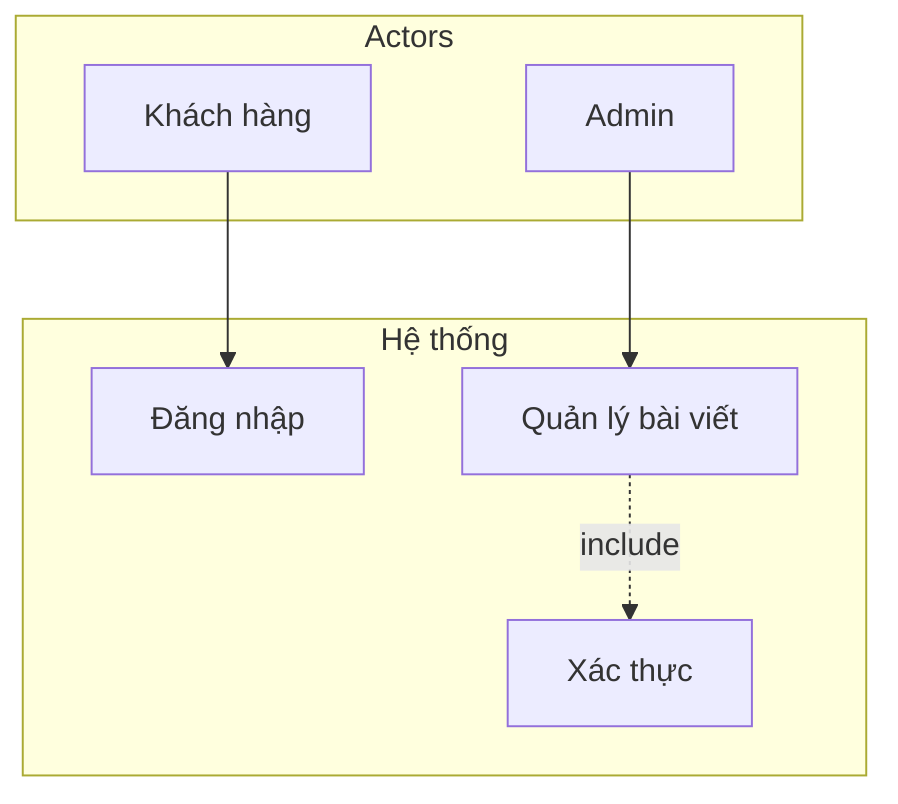
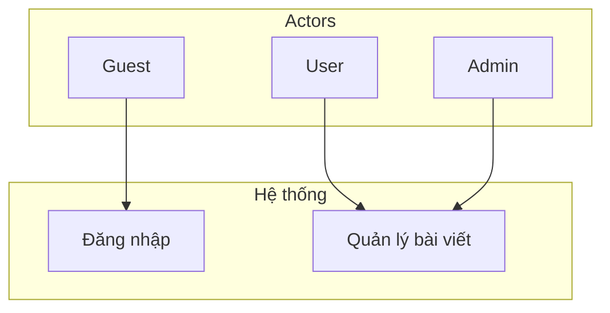
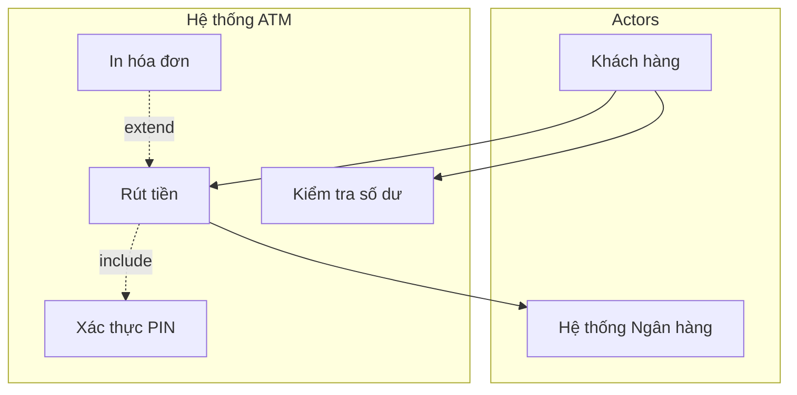
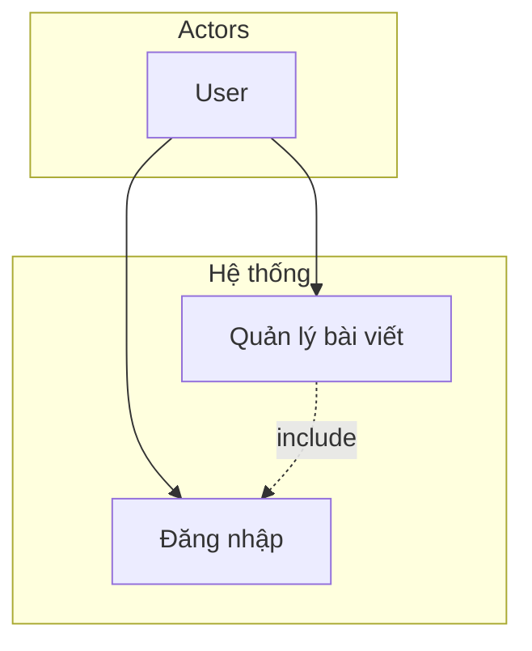
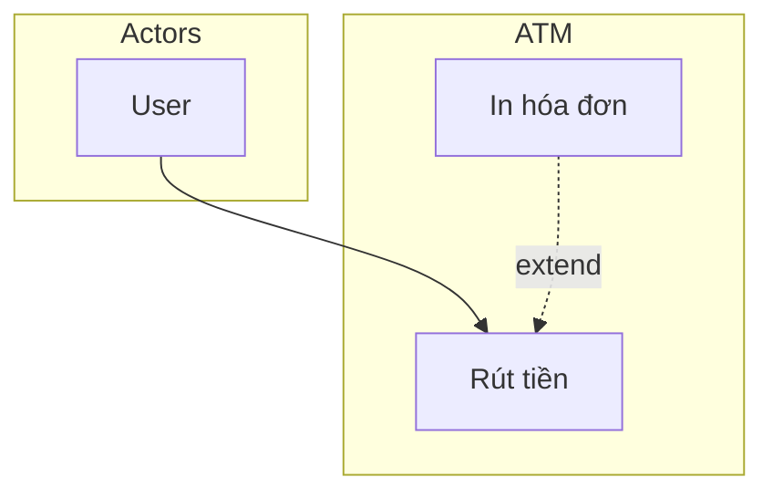

# Use Case Diagram Specialist

## Overview

**Purpose**: Expert in researching, analyzing, and building Use Case diagrams (UML) for
functional scope, actor–system interaction, and documentation.

**Category**: Tech
**Primary Users**: BA, product, tech-lead, architecture-validator

## When to Use This Skill

- Researching when and how to use Use Case diagrams
- Analyzing requirements or docs to identify actors and use cases
- Defining functional scope before Class/Sequence diagrams
- Creating Use Case diagrams in Mermaid (useCaseDiagram or flowchart)
- Writing Use Case Specifications (Main Flow, Exception)
- Communicating functional scope with BA / Dev / stakeholders

## Prerequisites

**Required:**

- Understanding of system/process to document
- Requirements or functional list (or user personas)
- Clarity on diagram type: Use Case (not flowchart/sequence)

**Optional:**

- Full research: [references/use-case-diagram-research.md](references/use-case-diagram-research.md)
- Example in project: `Docs/life-2/diagrams/UseCase/use-case-diagram.md`
- Index: [references/REFERENCES.md](references/REFERENCES.md)

## Input

**What the skill needs:**

- Process/system description or requirements doc
- List of roles (who uses the system) and external systems
- List of functionalities (verb + noun: Đăng nhập, Quản lý bài viết...)
- Optional: existing diagram to extend or refine

## Workflow

### Step 1: Research & Diagram Type

**Objective**: Confirm Use Case diagram is the right choice and when to use it

**When to use Use Case:**

- After user personas/survey; before Class/Sequence diagrams
- To define functional scope and actor–system interaction
- Analysis & Design phase; basis for test cases and other diagrams

**Validation:**

- [ ] Goal is functional scope / actor interaction (not data flow or sequence)
- [ ] Audience and purpose clear
- [ ] References read if theory or 5-step process needed

**Output**: Confirmed Use Case diagram; optional research notes

### Step 2: Analyze – Identify Actors and Use Cases

**Objective**: Extract actors and use cases from requirements

**Actors:**

- Who uses the system? External systems? (Roles only, not individuals: "Admin" not "Thầy Tuấn")
- One actor can participate in many use cases

**Use Cases:**

- From requirements or functional breakdown
- Name: **Verb + Noun** (e.g. Đăng nhập, Thêm chuyên mục, Quản lý bài viết)
- Avoid: only noun ("Login form"); avoid micro-steps ("Nhập username", "Nhập password" as separate UCs)

**Relationships:**

- **Association**: Actor participates in Use Case → `Actor --> UC`
- **Include**: Base UC **must** call another UC → `UC1 ..> UC2 : <<include>>`
- **Extend**: Optional extension under condition → `UC2 ..> UC1 : <<extend>>`
- **Generalization**: Child actor inherits parent permissions → arrow child → parent actor

**Validation:**

- [ ] All actors identified (roles)
- [ ] Use cases are verb + noun; no micro-steps
- [ ] Include vs Extend clear (mandatory vs optional)
- [ ] Every UC adds value for at least one actor

**Output**: List of actors, use cases, and relationships

### Step 3: Build – Mermaid Use Case Diagram

**Objective**: Produce Mermaid diagram (useCaseDiagram or flowchart)

**Cú pháp chuẩn & tương thích (Mermaid 8.8+):**

- **useCaseDiagram**: Có thể cần Mermaid 10+; nếu gặp "Syntax error in graph" trên 8.8, dùng **flowchart** (Option B) thay thế.
- **Flowchart**: (1) Tránh dùng từ `end` (chữ thường) làm **nhãn node**—dùng "End" hoặc "END" nếu cần; (2) Nhãn có ký tự đặc biệt/Unicode (dấu, ngoặc) nên đặt trong ngoặc kép, ví dụ `["Đăng nhập"]`; (3) Cấu trúc subgraph: `subgraph title` … `end` (từ khóa `end` ở đây là cú pháp, không phải node).
- **Chung**: Mỗi khối diagram phải bắt đầu bằng ` ```mermaid ` và kết thúc bằng ` ``` ` trên dòng riêng; không có ký tự thừa trong block.

**Syntax – useCaseDiagram (UML-style, Mermaid 10+).** Trên 8.8 dùng flowchart bên dưới.



**Components:**

| Component       | Mermaid                       | Note                       |
| --------------- | ----------------------------- | -------------------------- |
| Actor           | `actor "Name" as X`         | Role, outside boundary     |
| Use Case        | `usecase "Name" as UC`      | Inside system              |
| System Boundary | `package "System" { ... }`  | Rectangle around UCs       |
| Association     | `Actor --> UC`              | Actor participates         |
| Include         | `UC1 ..> UC2 : <<include>>` | Mandatory sub-UC           |
| Extend          | `UC2 ..> UC1 : <<extend>>`  | Optional extension         |
| Generalization  | Arrow child actor → parent   | Child inherits permissions |

**Syntax – flowchart (project convention, tương thích 8.8; nhãn Unicode trong ngoặc kép):**



**Example – ATM Use Case (flowchart, tương thích 8.8):**



**Validation:**

- [ ] All actors and use cases from Step 2 included
- [ ] System boundary (package/subgraph) correct
- [ ] Include/Extend direction correct (include: base → included; extend: extension → base)
- [ ] Diagram renders in target (GitHub, VS Code, Mermaid Live)

**Output**: Mermaid Use Case diagram

### Step 4: Use Case Specification (Optional)

**Objective**: Add detailed spec for selected use cases (Main Flow, Exception)

**Template**: [templates/use-case-specification.example.md](templates/use-case-specification.example.md)

**Fields:**

| Mục               | Mô tả                              |
| ------------------ | ------------------------------------ |
| Tên UC            | ID + tên chức năng                |
| Tác nhân         | Actor chính                         |
| Tiền điều kiện | Điều kiện trước khi thực hiện |
| Hậu điều kiện  | Kết quả sau khi thành công       |
| Trigger            | Sự kiện bắt đầu                 |
| Main Flow          | Các bước chính (1. 2. 3. …)     |
| Exception          | Lỗi / ngoại lệ (3a. 3b. …)       |

**Validation:**

- [ ] Main Flow covers happy path
- [ ] Exceptions reference step numbers (e.g. 3a, 3b)
- [ ] Pre/post conditions consistent with diagram

**Output**: Use Case Specification (markdown table + Main Flow + Exception)

## Output

**Produces:**

- Mermaid Use Case diagram (useCaseDiagram or flowchart) in markdown
- Optional Use Case Specification per use case
- File under `Docs/life-2/diagrams/` (e.g. `UseCase/use-case-diagram.md`) with blockquote: **Mục đích** + **Format: Mermaid**

**Success Criteria:**

- [ ] Diagram matches analyzed actors and use cases
- [ ] Include/Extend/Association correct
- [ ] System boundary clear; actors outside
- [ ] Renders correctly in markdown viewer
- [ ] When creating/editing files: annotate **"File tạo: &lt;path&gt;"** or **"File sửa: &lt;path&gt;"**

## Best Practices

1. **Naming**: Use **Verb + Noun** for use cases; avoid noun-only or micro-steps
2. **Actors**: Roles only (e.g. Admin, User), not specific people
3. **Include vs Extend**: Include = mandatory; Extend = optional under condition
4. **Scope**: Split large "Quản lý hệ thống" into smaller UCs; group small steps into one UC
5. **Specification**: Use Use Case Specification for critical or complex use cases
6. **Consistency**: Prefer one style (useCaseDiagram or flowchart) per project
7. **References**: Keep diagram in markdown; link to references when theory/process needed

## Common Patterns

### Auth-gated feature

(Dùng flowchart để tương thích Mermaid 8.8; nếu dùng Mermaid 10+ có thể đổi sang `useCaseDiagram`.)



### Optional extension (e.g. print receipt)



## Notes

- Use Case diagram is behavioral (UML); focus on **who** does **what** with the system
- Basis for Sequence Diagram (per-UC flow) and Class Diagram (structure to support UCs)
- Mermaid useCaseDiagram (có thể cần 10+): [mermaid.js.org/syntax/useCaseDiagram](https://mermaid.js.org/syntax/useCaseDiagram.html). Nếu 8.8 báo lỗi, dùng flowchart (Option B).
- Full theory and 5-step process: [references/use-case-diagram-research.md](references/use-case-diagram-research.md)
- Repo research copy: `Docs/diagram/use-case-diagram-research.md`
- Always annotate **File tạo** / **File sửa** with full path when creating or editing files

---

## Xác định phiên bản Mermaid (để chọn cú pháp đúng)

| Môi trường | Cách biết version | Ghi chú |
|------------|-------------------|---------|
| **Browser / trang có nhúng Mermaid** | Trong Console (F12): gõ `mermaid.version` sau khi trang đã load Mermaid. | Chỉ dùng được khi trang expose biến `mermaid` (CDN, script tag). |
| **VS Code / Cursor (Markdown preview)** | Xem extension đang dùng: *Markdown Preview Mermaid Support* (bierner.markdown-mermaid) thường bundle **Mermaid 11.x**; extension khác có thể bundle 8.x–10.x. Vào Extensions → tìm "Mermaid" → xem mô tả/Release Notes để biết version bundle. | Nếu preview báo "Syntax error" với useCaseDiagram thì môi trường đang dùng bản &lt; 10; chuyển sang **flowchart**. |
| **GitHub (Markdown trong repo)** | GitHub dùng phiên bản Mermaid do họ cố định; thay đổi theo thời gian. Không có API để đọc version. | Ưu tiên **flowchart** để an toàn; hoặc thử useCaseDiagram, lỗi thì đổi lại flowchart. |
| **Node.js / build script** | Trong project: `package.json` → `dependencies`/`devDependencies` → xem `"mermaid": "^x.y.z"`. Hoặc chạy `node -e "console.log(require('mermaid/package.json').version)"` (nếu dùng CommonJS). | Mermaid 10+ chỉ còn ESM; 8.x–9.x có CommonJS. |
| **Obsidian (bản mới nhất)** | Obsidian 1.8.5+ (Desktop) tích hợp sẵn Mermaid **11.4.1** (core plugin). Xem *Settings → About* để biết version Obsidian. | **Có thể dùng useCaseDiagram** (actor, package, usecase, include/extend). Flowchart vẫn dùng được. |
| **Mermaid Live Editor (mermaid.live)** | Trang thường dùng bản mới nhất; xem footer hoặc About. | Dùng để thử cú pháp useCaseDiagram trước khi dùng trong file. |

**Tích hợp đúng cú pháp:**

1. **Không biết version / nhiều môi trường:** Dùng **flowchart** (Option B) cho Use Case diagram — chạy ổn từ Mermaid 8.8.
2. **Chắc chắn Mermaid 10+:** Có thể dùng **useCaseDiagram** (actor, package, usecase, `..>` include/extend).
3. **Có quyền sửa trang/extension:** Kiểm tra `mermaid.version` (browser) hoặc dependency trong `package.json` (Node); ghi lại version tối thiểu (vd. "useCaseDiagram từ 10.0") trong tài liệu hoặc comment.

---

## Cú pháp chuẩn (Mermaid 8.8+)

| Nội dung                          | Chuẩn                                                                                                                                                                      |
| ---------------------------------- | --------------------------------------------------------------------------------------------------------------------------------------------------------------------------- |
| **Loại diagram**            | `useCaseDiagram` (Mermaid 10+) hoặc `flowchart TB`/`flowchart LR` (8.8 an toàn).                                                                                    |
| **Flowchart – nhãn node**  | Có ký tự đặc biệt/Unicode/dấu → dùng ngoặc kép:`id["Nhãn"]`. Ví dụ: `UC1["Đăng nhập"]`.                                                                |
| **Flowchart – từ “end”** | Không dùng chữ `end` (thường) làm **nhãn node** (gây lỗi). Dùng "End" hoặc "END". Từ khóa `end` đóng subgraph thì giữ nguyên.                   |
| **Flowchart – subgraph**    | `subgraph "Tiêu đề"` … `end`. Tiêu đề có khoảng trắng/Unicode nên để trong ngoặc kép.                                                                    |
| **useCaseDiagram**           | `actor "Tên" as X`, `usecase "Tên" as UC`, `package "Hệ thống" { ... }`, `-->` (association), `..>` (include/extend).                                         |
| **Code block**               | Bắt đầu bằng dòng ` ```mermaid ` và kết thúc bằng ` ``` `; không ký tự thừa trong block.                                                                   |
| **Tham chiếu**              | Flowchart:[mermaid.js.org/syntax/flowchart](https://mermaid.js.org/syntax/flowchart.html). Context7: resolve `mermaid` → query-docs với libraryId `/mermaid-js/mermaid`. |
