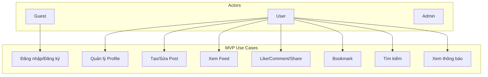

# Use Case Diagram

> **Mục đích:** Actors và interactions với hệ thống  
> **Format:** Mermaid  

---

<!-- Mở rộng theo 10 MVP features: Auth, Profile, Posts, Feed, Interactions, Bookmark, Search, Notifications, Moderation, Privacy -->
